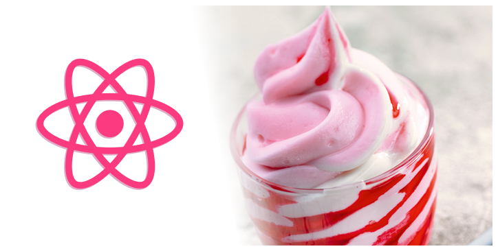

# Sundaes On Demand
> :ice_cream: Yummy!

 

Plateforme de personnalisation et de commande en ligne de desserts glacés développée avec React en suivant la méthode TDD (Test-Driven Development).

## Frameworks utilisés

- [React](https://fr.reactjs.org/)
- [Fastify](https://www.fastify.io/)

## Librairies utilisées

- [React Testing Library](https://testing-library.com/)
- [Jest](https://jestjs.io/)
- [Supertest](https://github.com/visionmedia/supertest)

## Meta
Damien Heulin – [Twitter](https://twitter.com/damien_hl) – [Mail](mailto:damienheulin87@gmail.com) – [Github](https://github.com/damien-hl)